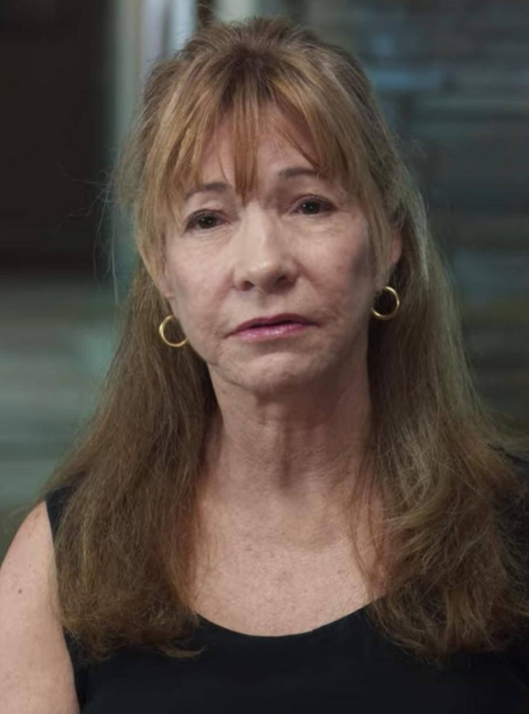

# Roberta Williams: A Pioneira dos Jogos de Aventura Gráfica

**Roberta Heuer Williams** (nascida em 16 de fevereiro de 1953) é uma das figuras mais influentes e reverenciadas na história dos videogames. Como co-fundadora da Sierra On-Line, juntamente com seu marido Ken Williams, ela foi pioneira no gênero de aventura gráfica, cativando uma geração de jogadores com suas narrativas ricas e mundos imersivos.

---

## Início da Vida e a Faísca da Criação

Nascida em La Verne, Califórnia, Roberta não tinha formação em programação ou design de jogos. Sua jornada começou no final dos anos 1970, quando ela descobriu o jogo de aventura em texto "Colossal Cave Adventure". Fascinada pela possibilidade de contar histórias interativas, mas sentindo a falta de um elemento visual, ela teve a ideia de adicionar gráficos às aventuras baseadas em texto.

Essa visão levou à criação de seu primeiro jogo. Com Roberta escrevendo a história e o design, e Ken programando, eles desenvolveram **Mystery House** (1980). Lançado para o computador Apple II, foi um sucesso revolucionário e é amplamente considerado o primeiro jogo de aventura com gráficos, marcando o nascimento de um novo gênero.

## A Fundação da Sierra On-Line

O sucesso de "Mystery House" levou o casal a fundar a **On-Line Systems**, que mais tarde se tornaria a icônica **Sierra On-Line**. A empresa rapidamente se tornou uma força dominante na indústria de jogos para PC durante as décadas de 1980 e 1990. Sob a liderança criativa de Roberta, a Sierra definiu o padrão para jogos de aventura, combinando quebra-cabeças desafiadores com narrativas envolventes e tecnologia de ponta.

A filosofia de design de Roberta sempre se concentrou na história. Ela era uma contadora de histórias nata, inspirando-se em contos de fadas, mitologia e mistério para criar mundos que os jogadores pudessem explorar.

## Obras Mais Notáveis

O portfólio de Roberta Williams inclui alguns dos jogos mais amados e importantes da era de ouro dos jogos de aventura.

### A Série King's Quest

A magnum opus de Roberta é, sem dúvida, a série **King's Quest**. Lançado em 1984, *King's Quest I: Quest for the Crown* foi um título inovador que introduziu um personagem animado que podia se mover por trás e na frente de objetos em cenários coloridos, criando uma sensação de profundidade e um mundo 3D pseudo-animado. A saga da família real de Daventry se estendeu por oito jogos principais, cada um expandindo o mundo e a tecnologia.

* **King's Quest I: Quest for the Crown** (1984)
* **King's Quest II: Romancing the Throne** (1985)
* **King's Quest III: To Heir Is Human** (1986)
* **King's Quest IV: The Perils of Rosella** (1988)
* **King's Quest V: Absence Makes the Heart Go Yonder!** (1990)
* **King's Quest VI: Heir Today, Gone Tomorrow** (1992)
* **King's Quest VII: The Princeless Bride** (1994)
* **King's Quest VIII: Mask of Eternity** (1998)

### Phantasmagoria: O Terror Interativo

Em 1995, Roberta se afastou dos contos de fadas para explorar o horror. **Phantasmagoria** foi um projeto ambicioso e controverso que utilizou a tecnologia de *full-motion video* (FMV) com atores reais. Com seu roteiro de mais de 550 páginas e conteúdo gráfico explícito, o jogo foi um sucesso comercial que demonstrou a versatilidade de Roberta como designer e sua vontade de ultrapassar os limites da narrativa interativa.

### Outros Clássicos

* **The Dagger of Amon Ra** (1992): Um aclamado jogo de mistério e assassinato da série Laura Bow.
* **The Colonel's Bequest** (1989): O primeiro jogo da série de mistério Laura Bow.
* **Mixed-Up Mother Goose** (1987): Um popular jogo de aventura educacional para crianças.

---

## Legado e Retorno

Roberta Williams se aposentou da indústria de jogos em 1999, após a venda da Sierra. Seu trabalho, no entanto, deixou uma marca indelével. Ela não apenas criou um gênero, mas também defendeu a ideia de que os jogos poderiam ser uma poderosa forma de contar histórias. Muitas de suas criações apresentavam protagonistas femininas fortes, algo raro na época.

Por suas contribuições, ela recebeu vários prêmios, incluindo o **Industry Icon Award** no The Game Awards de 2014.

Após um longo hiato, em 2023, Roberta e Ken Williams retornaram ao desenvolvimento de jogos com um remake em 3D de **Colossal Cave Adventure**, o mesmo jogo que a inspirou décadas atrás, provando que sua paixão pela criação de mundos interativos permanece tão forte como sempre.