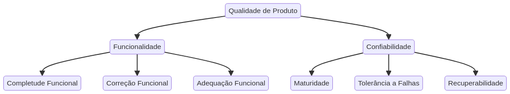

# 📋 **Fase 1: Estabelecer os Requisitos da Avaliação**

## **Contexto do Projeto**

O Mozilla Firefox é um navegador web de código aberto, desenvolvido pela Mozilla Foundation e sua subsidiária, Mozilla Corporation. Lançado inicialmente em 2004, o projeto surgiu com o objetivo de oferecer uma alternativa mais rápida, privada e personalizável a outros navegadores da época, como o Internet Explorer. O Firefox é construído sobre uma abordagem baseada em comunidades, aproveitando o poder criativo de desenvolvedores em todo o mundo para inovar e manter a Internet aberta e acessível.

## **Objetivo do Firefox**

O objetivo de negócio principal do projeto Firefox, alinhado com a missão mais ampla da Mozilla, é **garantir que a Internet permaneça um recurso público global, aberto e acessível a todos**. 

### **Pilares Estratégicos**

- **Promover a abertura e a inovação na web**: Desenvolver um navegador que suporte padrões abertos e incentive a inovação, evitando o controle de uma única entidade sobre a experiência online.

- **Proteger a privacidade e a segurança do usuário**: Oferecer aos usuários ferramentas e funcionalidades que lhes permitam controlar seus dados e navegar de forma segura e privada.

- **Capacitar os indivíduos**: Dar aos usuários a capacidade de personalizar sua experiência na web e ter controle sobre seu ambiente online.

- **Construir uma comunidade global**: Fomentar uma comunidade de colaboradores que trabalham juntos para melhorar o navegador e a web como um todo.

!!! note "Propósito Central"
    Em essência, o Firefox busca criar valor econômico e social ao priorizar o benefício público e os direitos dos usuários na Internet, em vez de focar exclusivamente no lucro comercial.

### **Propósito da Avaliação e Melhoria de Qualidade: Funcionalidade e Confiabilidade**

O propósito desta avaliação de qualidade é analisar e propor melhorias para o projeto Firefox, com foco específico em **Funcionalidade** e **Confiabilidade**. Estes dois atributos são cruciais para a experiência do usuário e para o cumprimento dos objetivos de negócio do projeto.

## **Conexão com os ODS da ONU**

### ODS 4 – Educação de Qualidade
- O navegador é gratuito e open source, permitindo que escolas ou universidades usem sem custos de licença
- Pode ser estudado como código aberto, gerando aprendizado em programação e segurança
- Recursos como modo leitura e extensões educacionais tornam o acesso ao conhecimento mais inclusivo

### ODS 9 – Indústria, Inovação e Infraestrutura
- O Firefox, por ser um projeto aberto, estimula a inovação tecnológica e a colaboração entre diferentes atores
- Fortalece a construção de uma infraestrutura digital baseada em transparência e padrões abertos

### ODS 10 – Redução das Desigualdades
- Por ser um software livre e aberto, o Firefox favorece o acesso democrático à tecnologia
- Promove inclusão digital e contribui para tornar o ambiente online mais justo e igualitário

### ODS 16 – Paz, Justiça e Instituições Eficazes
- O Firefox protege a privacidade dos usuários, garantindo liberdade digital e maior segurança no uso da internet
- Promove o acesso aberto à informação ao combater práticas abusivas de rastreamento e monopólio de dados
- Fortalece os direitos digitais e liberdades fundamentais, alinhando-se à meta 16.10 da ONU (assegurar acesso público à informação e proteger direitos básicos)

## **Modelo de Qualidade Utilizado**

A avaliação do navegador Mozilla Firefox será realizada com base no modelo da norma **ISO/IEC 25010**, enfatizando as seguintes características de qualidade:

### **Características Priorizadas**

#### **Adequação Funcional**
Analisa a capacidade do navegador em oferecer funções que atendam de forma completa, correta e adequada às necessidades dos usuários, incluindo:
- Compatibilidade com padrões web
- Suporte a extensões
- Segurança de navegação
- Recursos de personalização

Esta característica relaciona-se diretamente ao propósito do Firefox de proporcionar uma navegação plena e alinhada a padrões abertos da web.

#### **Confiabilidade**
Considera a robustez do navegador frente a falhas, sua capacidade de manter desempenho estável sob condições variadas de uso (como múltiplas abas abertas) e a recuperação diante de erros. 

Esta característica está conectada ao propósito do Firefox de oferecer uma navegação segura e estável, transmitindo confiança ao usuário.

### **Matriz de Priorização**

| Característica           | Nível de Ênfase | 
|--------------------------|-----------------|
| Adequação Funcional      | 5 |
| Confiabilidade           | 5 | 
| Manutenibilidade         | 1 | 
| Portabilidade            | 1  |
| Eficiência de Desempenho | 1  | 
| Compatibilidade          | 1 |
| Segurança                | 1 | 
| Usabilidade              | 0 |

### **Classificação do Tipo de Produto**

O Mozilla Firefox pode ser classificado, segundo as categorias apresentadas por Pressman, como um software de computador pessoal, pois é utilizado diretamente pelo usuário final para navegação na web, acesso a informações, execução de aplicações online e interação com diferentes serviços digitais.

De acordo com a classificação da IEEE 1062, o Firefox enquadra-se como um COTS (Commercial Off-The-Shelf Software), uma vez que é um produto pronto, desenvolvido pelo fabricante e disponibilizado a um público amplo, sem customizações específicas para clientes individuais. Embora seja gratuito e de código aberto, mantém as características de um produto de prateleira, projetado para atender de forma generalista às necessidades da maioria dos usuários.

### **Escopo, profundidade e objetos de avaliação**

O escopo desta avaliação contempla a versão estável atual do navegador Mozilla Firefox para desktop, considerando seu uso por usuários finais em atividades cotidianas de navegação na web. A profundidade da análise será limitada às características de qualidade Funcionalidade e Confiabilidade. Os objetos de avaliação correspondem às funções principais do navegador e à sua capacidade de manter operação estável e segura frente a falhas.

### **Requisitantes e Partes Interessadas**

Embora este trabalho acadêmico não tenha um requisitante direto, no contexto real do desenvolvimento do Mozilla Firefox os principais requisitantes são a própria Mozilla Foundation/Mozilla Corporation, a comunidade de desenvolvedores voluntários, usuários avançados que sugerem melhorias e empresas/parceiros de tecnologia que integram seus serviços ao navegador.
As principais partes interessadas abrangem os usuários finais que utilizam o Firefox diariamente, os desenvolvedores web que dependem de compatibilidade com padrões abertos, a comunidade open source que participa de sua evolução, além da sociedade civil e organizações de defesa digital, que se beneficiam da proteção de privacidade e do acesso aberto à informação promovidos pelo navegador.

| 🎓 Matrícula | 🙋 Nome completo | 📊 Contribuição (%) |
|-------------|------------------|---------------------|
| 211061565 | [Daniel Ferreira Nunes ](https://github.com/Mach1r0) | 16.66 |
| 221008632 | [Eduardo Ferreira](https://github.com/eduardoferre) | 16.66 |
| 231011275 | [Eduardo Morais](https://github.com/Edumorais08) | 16.66 |
| 221029249 | [Julia Takaki](https://github.com/juliatakaki) | 16.66 |
| 222037737 | [Matheus Brant](https://github.com/MatheussBrant) | 16.66 |

