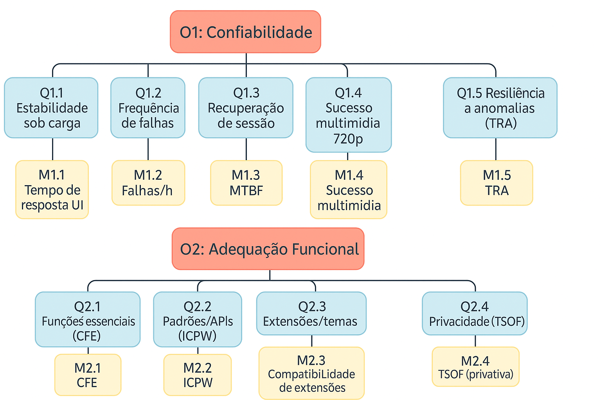

# **Fase 02 - Especificação da Avaliação**

##  Modelo GQM (Goal-Question-Metric)

Nesta segunda fase do projeto será utilizado o modelo GQM (Goal Question Metric) para definir metas, perguntas e métricas relacionadas ao projeto de desenvolvimento do software. O modelo GQM é uma abordagem estruturada que ajuda a garantir que as métricas coletadas sejam relevantes e alinhadas com os objetivos do projeto. Ele é composto por três níveis principais:

1. **Goal (Meta)** — Define o que se deseja alcançar com o projeto. As metas devem ser específicas, mensuráveis, alcançáveis, relevantes e temporais (SMART).
2. **Question (Pergunta)** — Formula perguntas que ajudam a entender se as metas estão sendo alcançadas. Essas perguntas devem ser claras e focadas nos aspectos críticos do projeto.
3. **Metric (Métrica)** — Identifica as métricas que serão usadas para responder às perguntas e avaliar o alcance das metas.


##  Medição 1 - Confiabilidade

### Dimensões da Análise

| **Dimensão** | **Descrição** |
|:---|:---|
| **Objeto da análise** | Mozilla Firefox (Navegador Web) |
| **Propósito** | Avaliar a capacidade do navegador Firefox de manter seu nível de desempenho sob condições especificadas por um período de tempo. Isso envolve analisar a estabilidade (ausência de falhas e travamentos), robustez (capacidade de lidar com erros e condições inesperadas) e a precisão dos resultados de suas operações. |
| **Característica de análise** | Confiabilidade |
| **Perspectiva de Avaliação** | Usuário Final / Comunidade Mozilla |
| **Contexto** | Análise de Qualidade de Software |

### Goal (Meta)

Analisar a **robustez e estabilidade** do Mozilla Firefox, bem como sua capacidade de manter desempenho consistente e se recuperar de falhas sob condições variadas de uso, a fim de identificar pontos fortes e áreas de melhoria relacionadas à sua confiabilidade.

**Estrutura GQM**

* **Foco ISO/IEC 25010:** **Confiabilidade** (robustez, estabilidade, recuperabilidade)
* **Ponto de Vista (POV):** Persona *“multitarefa conectada”* (definida na **Fase 1**)
* **Contexto (Fluxo):** sessão de **30–60 min** com **6–12 abas**, conteúdo misto (**notícia + streaming 720p + rede social**), produtividade (doc online) e **janela privativa** (ver **Fluxo Cotidiano** na Fase 1)
* **Objeto de Avaliação:** Firefox **145.0.1** (desktop): gerenciamento de **abas/sessão**, rede/mídia, engine/renderização/**JS**

### Questions (Perguntas), Métricas, Justificativas e Hipóteses

A avaliação da **Confiabilidade** do Mozilla Firefox se concentrará na sua capacidade de manter um desempenho estável e consistente sob diversas condições de uso, resistir a falhas e se recuperar eficientemente quando problemas ocorrem.

#### Questões 

* **Q1.1** O navegador mantém desempenho estável com 6–12 abas e conteúdo multimídia?
* **Q1.2** Qual a frequência de falhas/travamentos/lentidão no uso contínuo?
* **Q1.3** Em caso de falha, o navegador recupera e restaura a sessão (abas/dados) rapidamente? *(ver [MTTR](#mttr-mean-time-to-recovery) e [Restauração de sessão](#restauração-de-sessão))*
* **Q1.4** A reprodução de vídeo/áudio em streaming 720p ocorre sem interrupções ou dessincronias?
* **Q1.5** O navegador tolera condições anômalas (ex.: queda de rede curta, pico de CPU/memória) sem degradar severamente? *(ver [TRA](#tra-taxa-de-resiliência-a-anomalias))*

#### Hipóteses

* **H1.1** Desempenho estável sob a carga típica do fluxo.
* **H1.2** **Taxa de falhas < 0,1/hora**.
* **H1.3** **[MTTR](#mttr-mean-time-to-recovery)** baixo com **[restauração de sessão](#restauração-de-sessão)** confiável; **[MTBF](#mtbf-mean-time-between-failures) > 24h**.
* **H1.4** **Sucesso multimídia > 98%** (720p).
* **H1.5** **[TRA](#tra-taxa-de-resiliência-a-anomalias) ≥ 90%** dos cenários de anomalia especificados.


#### Métricas — Detalhamento, Fórmulas e Coleta

* **M1.1 — Tempo de Resposta da [UI](#ui-interface-do-usuário) (ms)**
  **Q:** Q1.1 • **Tipo:** tempo • **Fórmula:** média(tempos de interação)
  **Unidade:** ms • **Coleta:** [DevTools](#devtools) / cronômetro (10 interações/sessão) • **Amostragem:** 5 sessões
  **Condições:** 6–12 abas, 1 aba com vídeo 720p, alternância rápida

* **M1.2 — Taxa de Falhas por Hora**
  **Q:** Q1.2 • **Tipo:** taxa • **Fórmula:** nº falhas / horas de uso
  **Unidade:** falhas/h • **Coleta:** registro manual / [log de crash](#log-de-crash) • **Amostragem:** 5 sessões de 60 min
  **Condições:** fluxo completo contínuo

* **M1.3 — [MTBF](#mtbf-mean-time-between-failures) (h)**
  **Q:** Q1.2/Q1.3 • **Tipo:** tempo médio • **Fórmula:** horas totais / nº falhas
  **Unidade:** h • **Coleta:** registro do tempo até falha • **Amostragem:** 5 execuções
  **Condições:** rede doméstica estável

* **M1.4 — Sucesso Multimídia (%)**
  **Q:** Q1.4 • **Tipo:** proporção • **Fórmula:** (reproduções OK / tentativas) × 100
  **Unidade:** % • **Coleta:** observação (10 vídeos de 5 min) • **Amostragem:** 3 sessões
  **Condições:** streaming 720p contínuo

* **M1.5 — [TRA](#tra-taxa-de-resiliência-a-anomalias): Taxa de Resiliência a Anomalias (%)**
  **Q:** Q1.5 • **Tipo:** proporção • **Fórmula:** (cenários anômalos suportados / cenários testados) × 100
  **Unidade:** % • **Coleta:** executar 5 cenários (queda de rede breve, pico CPU, baixa RAM, erro 500, timeout) • **Amostragem:** 3 sessões
  **Condições:** repetir cada cenário 3× e registrar sucesso/degeneração

##### Limiar de Julgamento (O1)

| Métrica            |   Ruim |  Regular |       Bom | Excelente |
| ------------------ | -----: | -------: | --------: | --------: |
| **M1.1** UI (ms)   | > 1000 | 500–1000 | **< 500** | **< 250** |
| **M1.2** Falhas/h  |  ≥ 0,5 |  0,1–0,5 | **< 0,1** |     **0** |
| **M1.3** MTBF (h)  |   < 12 |    12–24 |  **> 24** |  **> 48** |
| **M1.4** Mídia (%) |   < 90 |    90–98 |  **> 98** |   **100** |
| **M1.5** TRA (%)   |   < 80 |    80–89 |  **≥ 90** |  **≥ 95** |

> **Riscos/Mitigações:** Rede pode mascarar latências (medir interações locais); subjetividade na coleta de falhas (planilha padrão + evidências); variação de cache (limpar entre sessões); anomalias agressivas (limitar duração e registrar contexto).

##### Critérios de Julgamento — O1

* **Q1.1** atendida se **M1.1 ≥ Bom**.
* **Q1.2/Q1.3** atendidas se **M1.2** e **M1.3 ≥ Bom**.
* **Q1.4** atendida se **M1.4 ≥ Bom**.
* **Q1.5** atendida se **M1.5 ≥ Bom**.
* **O1 (Confiabilidade)** = **ATINGIDO** se **todas** Q1.1–Q1.5 ≥ Bom. Se **M1.2 = Ruim** **ou** **M1.3 = Ruim**, **NÃO ATINGIDO** (abrir *[issue](#issue)* de alta prioridade; ver critérios de acionamento na **Fase 1**).


##  Medição 2 - Adequação Funcional

### Dimensões da Análise

| **Dimensão** | **Descrição** |
|:---|:---|
| **Objeto da análise** | Mozilla Firefox (Navegador Web) |
| **Propósito** | Avaliar se o navegador Firefox atende às necessidades e expectativas dos usuários em termos de recursos, capacidades e desempenho. Isso inclui verificar se todas as funções declaradas operam corretamente, se o navegador é compatível com uma ampla gama de tecnologias web e se oferece uma experiência de navegação rica e completa. |
| **Característica de análise** | Funcionalidade |
| **Perspectiva de Avaliação** | Usuário Final / Comunidade Mozilla |
| **Contexto** | Análise de Qualidade de Software |

### Goal (Meta)

Avaliar se o Mozilla Firefox oferece **funções completas, corretas e apropriadas** às necessidades dos usuários, garantindo que suas principais operações como navegação, renderização de páginas, uso de abas, downloads, personalização e **sincronização** funcionem adequadamente e atendam aos objetivos de usabilidade e abertura da web.

**Estrutura GQM**

* **Foco ISO/IEC 25010:** **Adequação Funcional** (completude, correção, adequação)
* **Ponto de Vista (POV):** Persona *“multitarefa conectada”* (Fase 1)
* **Contexto (Fluxo):** mesmas 4 etapas do **Fluxo Cotidiano** (Fase 1)
* **Objeto de Avaliação:** funções essenciais no fluxo (abas, histórico, downloads, formulários, **sincronização**, **[extensões](#webextensions-extensões)/temas**, **privacidade**)

### Questions (Perguntas), Métricas, Justificativas e Hipóteses

A avaliação da **Funcionalidade** do Mozilla Firefox se concentrará em verificar se o navegador oferece um conjunto completo e adequado de recursos que satisfazem as necessidades dos usuários, operando de forma correta e compatível com o ecossistema web.

#### Questões 

* **Q2.1** O Firefox oferece e executa corretamente as funções essenciais (abas, histórico, downloads, favoritos, **sincronização**) no **fluxo**?
* **Q2.2** O navegador exibe corretamente páginas com padrões/APIs web relevantes ao **fluxo** (HTML/CSS/**JS**, mídia, formulários)? *(ver [ICPW](#icpw-índice-de-conformidade-com-padrões-web), [WPT](#wpt-web-platform-tests) e [BCD](#bcd-browser-compat-datamdn))*
* **Q2.3** **Extensões/temas** funcionam sem conflitos no **fluxo**?
* **Q2.4** **Privacidade** (janela privativa, bloqueios de rastreadores) opera como esperado no **fluxo**? *(ver [TSOF](#tsof-taxa-de-sucesso-de-operações-funcionais) e [Janela privativa](#janela-privativa))*

#### Hipóteses

* **H2.1** **[CFE](#cfe-cobertura-de-funcionalidades-essenciais) ≥ 95%** (funções essenciais completadas).
* **H2.2** **[ICPW](#icpw-índice-de-conformidade-com-padrões-web) ≥ 90%** para APIs/padrões utilizados.
* **H2.3** **Compatibilidade de extensões ≥ 90%** (5 extensões comuns).
* **H2.4** **[TSOF](#tsof-taxa-de-sucesso-de-operações-funcionais) (privativa) ≥ 95%** (login, navegação, checkout simulado, bloqueios).

---

#### Métricas — Detalhamento, Fórmulas e Coleta

* **M2.1 — [CFE](#cfe-cobertura-de-funcionalidades-essenciais): Cobertura de Funcionalidades Essenciais (%)**
  **Q:** Q2.1 • **Tipo:** proporção • **Fórmula:** (funções corretas / funções testadas) × 100
  **Unidade:** % • **Coleta:** checklist do **fluxo** (20 tarefas/sessão) • **Amostragem:** 5 sessões
  **Condições:** 4 etapas do **fluxo**

* **M2.2 — [ICPW](#icpw-índice-de-conformidade-com-padrões-web): Índice de Conformidade com Padrões Web (%)**
  **Q:** Q2.2 • **Tipo:** índice • **Fórmula:** cobertura de APIs/recursos do **fluxo** × 100 (via **[WPT](#wpt-web-platform-tests)/[BCD](#bcd-browser-compat-datamdn)** ou matriz própria)
  **Unidade:** % • **Coleta:** verificação de compatibilidade nas APIs/recursos usados • **Amostragem:** conjunto de APIs do **fluxo**
  **Condições:** páginas com recursos avançados de layout/**JS**/mídia

* **M2.3 — Compatibilidade de Extensões (%)**
  **Q:** Q2.3 • **Tipo:** proporção • **Fórmula:** (extensões OK / total testado) × 100
  **Unidade:** % • **Coleta:** testar **5 extensões** (bloqueador, tradutor, senhas, leitor PDF, utilidade) • **Amostragem:** mín. 3 sessões
  **Condições:** extensões ativas apenas nas etapas pertinentes

* **M2.4 — [TSOF](#tsof-taxa-de-sucesso-de-operações-funcionais) (Modo Privativo) (%)**
  **Q:** Q2.4 • **Tipo:** proporção • **Fórmula:** (operações bem-sucedidas / tentativas) × 100
  **Unidade:** % • **Coleta:** janela privativa em **3 e-commerces** (login, navegação, checkout simulado, relatório de bloqueios) • **Amostragem:** 10 tentativas/sessão × 3 sessões
  **Condições:** usar o painel nativo de proteções

##### Limiar de Julgamento (O2)

| Métrica                | Ruim | Regular |      Bom | Excelente |
| ---------------------- | ---: | ------: | -------: | --------: |
| **M2.1** CFE (%)       | < 80 |   80–94 | **≥ 95** |   **100** |
| **M2.2** ICPW (%)      | < 75 |   75–89 | **≥ 90** |  **> 95** |
| **M2.3** Extensões (%) | < 80 |   80–89 | **≥ 90** |   **100** |
| **M2.4** TSOF (%)      | < 85 |   85–94 | **≥ 95** |   **100** |

> **Riscos/Mitigações:** [WPT](#wpt-web-platform-tests) complexo (usar subconjunto ligado ao **fluxo** / usar [BCD](#bcd-browser-compat-datamdn)); variação de técnicas de rastreamento (priorizar relatório nativo); interferência de extensões (limitar ao necessário).

##### Critérios de Julgamento — O2

* **Q2.1–Q2.4** atendidas se cada métrica associada **≥ Bom**.
* **O2 (Adequação Funcional)** = **ATINGIDO** se **≥ 3 de 4** questões **≥ Bom**.
* Se **M2.1 (CFE) < 90%**, **NÃO ATINGIDO** (registrar **[dívida técnica](#dívida-técnica)** e plano de correção) — conforme critérios de ação da **Fase 1**.


## Árvore GQM



---

## Plano de Coleta de Dados (passo a passo)

**Preparação (antes de cada sessão):**

1. **Instalar/confirmar** Firefox **145.0.1** (desktop); limpar **cache/cookies/histórico**.
2. Garantir **rede doméstica estável**; desativar extensões não essenciais.
3. Configurar **5 extensões de teste**.
4. Preparar **instrumentos de coleta** (ver abaixo “Formas simples de registrar os dados”).


#### **Ficha de Registro por Sessão (checklist)**


```
ID da sessão: ________   Data: ____/____/______   SO: __________   Versão Firefox: 145.0.1
Abas (média): ____      Vídeo: ( ) 720p  ( ) 1080p

M1.1 Tempo resposta (ms): ______
M1.2 Falhas por hora: ______
M1.3 MTBF (h): ______
M1.4 Sucesso mídia (%): ______
M1.5 TRA (%): ______

M2.1 CFE (%): ______
M2.2 ICPW (%): ______
M2.3 Extensões OK (%): ______
M2.4 TSOF privativa (%): ______

Observações (eventos, prints, links): ____________________________________________
```


**Execução (seguir o Fluxo da Fase 1):**

1. **Início & Pesquisa (Q2.1, M2.1):** 3 buscas; abrir 6 abas; checar tarefas essenciais (abas, histórico, download pequeno, favoritos).
2. **Conteúdo Misto (Q1.1/Q1.2/Q1.4, M1.1–M1.4):** manter 6–12 abas; iniciar **vídeo 720p**; alternar abas; medir **tempo de resposta**; registrar **falhas/h** e interrupções de mídia; medir **tempo até falha** ([MTBF](#mtbf-mean-time-between-failures)).
3. **Produtividade (Q2.1/Q2.3, M2.1/M2.3):** editar doc online; iniciar **download de 100 MB**; testar 2–3 extensões; registrar **[CFE](#cfe-cobertura-de-funcionalidades-essenciais)** e compatibilidade.
4. **Privacidade (Q2.4, M2.4):** abrir **janela privativa**; acessar 3 e-commerces; verificar bloqueios de rastreadores e operações (login/navegação/checkout simulado).
5. **Anomalias (Q1.5, M1.5):** aplicar 5 cenários (queda breve de rede; pico CPU; baixa RAM; erro 500; timeout) e registrar **[TRA](#tra-taxa-de-resiliência-a-anomalias)**.
6. **Pós-sessão:** consolidar métricas; calcular médias/limiares por sessão.

### Evidências e Arquivos 

* **Planilha do Google** (ou PDFs exportados), **prints obrigatórios**: relatório de proteções (privativa), evidência de crash, página de testes de APIs ([WPT](#wpt-web-platform-tests)/[BCD](#bcd-browser-compat-datamdn)), player em 720p, checklist **[CFE](#cfe-cobertura-de-funcionalidades-essenciais)**.
* **Publicação:** anexar planilha/PDFs e prints no **repositório**; referenciar na **GitPage** e no **PDF** (com **data/versão**).


## Quadros Consolidados (Resultados)

### O1 — Confiabilidade

| Questão | Métrica(s) |    Resultado | Julgamento                 |
| ------- | ---------- | -----------: | -------------------------- |
| Q1.1    | M1.1       |       ___ ms | Ruim/Regular/Bom/Excelente |
| Q1.2    | M1.2       | ___ falhas/h | Ruim/Regular/Bom/Excelente |
| Q1.3    | M1.3       |        ___ h | Ruim/Regular/Bom/Excelente |
| Q1.4    | M1.4       |        ___ % | Ruim/Regular/Bom/Excelente |
| Q1.5    | M1.5       |        ___ % | Ruim/Regular/Bom/Excelente |

**Conclusão O1:** *ATINGIDO / NÃO ATINGIDO*.

### O2 — Adequação Funcional

| Questão | Métrica(s) | Resultado | Julgamento                 |
| ------- | ---------- | --------: | -------------------------- |
| Q2.1    | M2.1       |     ___ % | Ruim/Regular/Bom/Excelente |
| Q2.2    | M2.2       |     ___ % | Ruim/Regular/Bom/Excelente |
| Q2.3    | M2.3       |     ___ % | Ruim/Regular/Bom/Excelente |
| Q2.4    | M2.4       |     ___ % | Ruim/Regular/Bom/Excelente |

**Conclusão O2:** *ATINGIDO / NÃO ATINGIDO*.


## Rastreabilidade Fase 1 → Fase 2 

| Elemento da **Fase 1**                                  | Objetivo (F2)              | Questões (IDs) | Métricas (IDs) |
| ------------------------------------------------------- | -------------------------- | -------------- | -------------- |
| Fluxo cotidiano (30–60 min; 6–12 abas; 720p; privativa) | **O1** Confiabilidade      | Q1.1–Q1.5      | M1.1–M1.5      |
| Funções essenciais do fluxo                             | **O2** Adequação Funcional | Q2.1           | M2.1           |
| Padrões/APIs usados no fluxo                            | **O2** Adequação Funcional | Q2.2           | M2.2           |
| Extensões/temas no fluxo                                | **O2** Adequação Funcional | Q2.3           | M2.3           |
| Privacidade no e-commerce (privativa)                   | **O2** Adequação Funcional | Q2.4           | M2.4           |


## **Justificativa das Métricas**

* **[GQM](#gqm):** modelo para garantir que **cada métrica** responda a **uma pergunta** que, por sua vez, comprova **um objetivo**.
* **[ISO/IEC 25010](#isoiec-25010) — Confiabilidade & Adequação Funcional:** atributos centrais de qualidade que sustentam estabilidade, correção e completude.
* **M1.2 (Falhas/h) & M1.3 ([MTBF](#mtbf-mean-time-between-failures)):** indicadores clássicos na engenharia de software para **estabilidade** em uso contínuo.
* **M1.5 ([TRA](#tra-taxa-de-resiliência-a-anomalias)):** mede **tolerância a anomalias** (robustez) — essencial em ambientes com **rede variável**.
* **M2.2 ([ICPW](#icpw-índice-de-conformidade-com-padrões-web)):** **conformidade com padrões web** usando **[WPT](#wpt-web-platform-tests)** e/ou **[BCD](#bcd-browser-compat-datamdn)**.
* **Coleta/Evidência:** uso de **[DevTools](#devtools)**, **[logs de crash](#log-de-crash)**, **Bugzilla** (rastreamento de defeitos) e relatórios nativos de **privacidade** do Firefox.


## **Glossário**

### GQM

Método que liga **Objetivo → Pergunta → Métrica**, para medir só o que importa.

### ISO/IEC 25010

Norma internacional que define **características de qualidade** de software (ex.: confiabilidade, funcionalidade).

### POV (Ponto de Vista)

De **quem** estamos olhando a avaliação (ex.: usuário final).

### Fluxo cotidiano

Sequência de uso típica (buscar, ler notícias, vídeo 720p, rede social, documento on-line, janela privativa).

### UI (Interface do Usuário)

Telas e controles com os quais o usuário interage.

### MTBF — Mean Time Between Failures

**Tempo médio entre falhas** — quanto **maior**, melhor.

### MTTR — Mean Time To Recovery

**Tempo médio de recuperação** após falha — quanto **menor**, melhor.

### TRA — Taxa de Resiliência a Anomalias

Porcentagem de **situações anormais** em que o navegador continua funcionando.

### CFE — Cobertura de Funcionalidades Essenciais

Porcentagem de **recursos básicos** que funcionaram corretamente.

### ICPW — Índice de Conformidade com Padrões Web

Quão bem o navegador segue os **padrões da web** (HTML, CSS, APIs).

### WPT — Web Platform Tests

Conjunto público de testes para checar **interoperabilidade** entre navegadores.

### BCD — Browser-Compat-Data/MDN

Base pública que informa **quais recursos web cada navegador suporta**.

### TSOF — Taxa de Sucesso de Operações Funcionais

Percentual de **tarefas concluídas com sucesso** (ex.: baixar arquivo).

### DevTools

Ferramentas do navegador para **inspecionar e medir** páginas.

### Bugzilla

Sistema de **registro e acompanhamento de bugs** usado pela Mozilla.

### Go/No-Go

Decisão de **liberar** (go) ou **segurar** (no-go) uma versão.

### Dívida técnica

**Pendências** para resolver depois (ex.: CFE < 90%).

### WebExtensions (extensões)

Complementos que **adicionam funções** ao navegador.

### Janela privativa

Modo que **não salva histórico** e **bloqueia rastreadores**.

### Log de crash

Registro quando o navegador **fecha inesperadamente**.

### Restauração de sessão

Ao reabrir o navegador após fechar/crash, **recuperar abas e janelas** do usuário.

### Persona

Perfil fictício que representa um **tipo de usuário** (ex.: “multitarefa conectada”).


## Assunções e Limitações

* **Assunções:** vídeo **720p**, 6–12 abas, rede estável, extensões somente as de teste, sessões independentes com cache limpo.
* **Limitações:** mudanças de sites/APIs afetam **[ICPW](#icpw-índice-de-conformidade-com-padrões-web)/[TSOF](#tsof-taxa-de-sucesso-de-operações-funcionais)**; variação de rede pode interferir em **M1.1/M1.4**; mitigado via repetição e evidências.


## Uso de IA no Desenvolvimento do Trabalho

Foram utilizadas **ferramentas de IA generativas** para **apoiar pesquisas**, **formatar o texto** e **corrigir gramática/ortografia**. As saídas foram **revisadas criticamente** pela equipe, com checagem de coerência com a **Fase 1**.


## **Equipe e Contribuições**

| Matrícula | Nome completo                                        | Contribuição (%) |
| --------- | ---------------------------------------------------- | ---------------- |
| 211061565 | [Daniel Ferreira Nunes ](https://github.com/Mach1r0) | 20               |
| 221008632 | [Eduardo Ferreira](https://github.com/eduardoferre)  | 20               |
| 231011275 | [Eduardo Morais](https://github.com/Edumorais08)     | 20               |
| 221029249 | [Júlia Takaki](https://github.com/juliatakaki)       | 20               |
| 222037737 | [Matheus Brant](https://github.com/MatheussBrant)    | 20               |


##  Histórico de Versão

| **Versão** | **Data** | **Descrição** | **Autor** | **Revisor** |
|:---:|:---|:---|:---|:---|
| `1.0` | 12/10/2025 | Criação inicial do documento | [Daniel Ferreira](https://github.com/Mach1r0) | [Eduardo Ferreira](https://github.com/eduardoferre) |
| `1.1` | 13/10/2025 | Adição das métricas da Adequação Funcional | [Eduardo Morais](https://github.com/Edumorais08) | [Daniel Ferreira](https://github.com/Mach1r0) |
| `1.2` | 21/10/2025 | Adição de Perguntas, Métricas, Justificativas e Hipóteses para Funcionalidade e Confiabilidade | [Daniel Ferreira](https://github.com/Mach1r0) | [Eduardo Ferreira](https://github.com/eduardoferre) |
| `1.3` | 24/10/2025 | Modificação das Perguntas, Métricas e Adição de diagrama e tabelas| [Matheus Brant](https://github.com/MatheussBrant) | [Eduardo Morais](https://github.com/Edumorais08) |
| `1.4` | 24/10/2025 | Adicionando tabela de contribuição | [Daniel Ferreira](https://github.com/Mach1r0) | [Matheus Brant](https://github.com/MatheussBrant) |